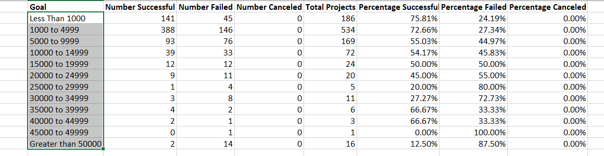
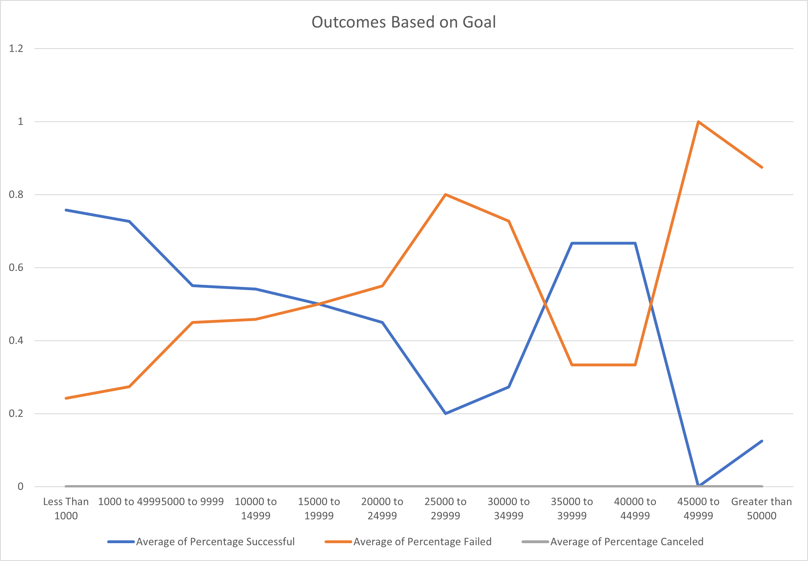

# An analysis of Kickstarter Campaigns

## Overview of Project
Louise’s play Fever came close to its fundraising goal in a short amount of time, and she would like to gain more knowledge about the major factors that would alter the campaign outcomes. This report analyzes how the outcomes of Kickstarter Campaigns (in category of theator) differ in relation to Launch Date and Campaigns Goals based on the data that is given in the kickstarterBook.
### Purpose
To make Louise understand how the major two factors could affact the her potential achievement in the crowdfunding, and give her advise on determaining the optimal launch date and goal levels that would help her succeed in her campaign. 
## Analysis and Challenges
A variety of Excel functions (including sorting, filtering, Vlookup, pivoting and etc.) were adopted to perform the analysis. Pivot charts were also utilized as usualizations to help us better understand the relationships between the variables. All the procedure related to the analysis are performed in the Excel file: [kickstarter_challenge,xlsx](Kickstarter_Challenge.xlsx)

### Analysis of Outcomes Based on Launch Date
To find out how the campaign turned out based on the launch date during the year from 2010 to 2017, we would like to combine the outcomes for all years and divide them according to the month of their launch date. Firstly, I added a column on the excel sheet and use `year()`function to exact the year from the "Date Created Conversion" column which was created earlier. Once I get the "years" for all campaigns, I can create a pivot table in a new sheet named "Theater Outcome by Launch Date". When creating the pivot table, I placed the "Date Created Conversion" in the rows, "Outcomes in the rows" in columns, "Count of outcomes" in the value and chose "years" and "Parent Category" as the filters.(shown below)

I filtered the "parent category" to only show the outcomes for Theatre campaigns and filtered "outcomes" to only show the completed campaigns (eliminating "live"). After those steps, I get a pivot table that looks like the following: 

According to the above pivot table, I created a line chart (shown below) using the "pivot chart" function to illustrate the trend of the outcomes with launch dates in different months of a year.

### Analysis of Outcomes Based on Goals
To find out the relationship between the outcomes and the goals, we need to divide the goals into different ranges according to its dollar value. When we take a look at the data, we see that most of the goals were between $1000 to $50,000. Therefore, we use $1000 as the lower bond and $50000 as the higher bond, and all the values in the middle are equally divided into 10 range groups, with $5000 for each interval. Then I use the `countif()`function to collect the numbers of different outcomes (successful, failed and canceled) for different goal ranges in the subacategory of "plays". I also calculated the percentages of different outcomes for each goal range, After that, we get a new table shown below:

After I have all the relevant data put together in one table, I created a Pivot table. I selected goals in the rows and average percentages different outcomes (succesful, failed and canceled) in the columns.(Because we only get one value for each outcome in each goal range, it doesn't matter if we select "sum" or "average", it will just show the original percentage.) Finally, I created the pivot chart (shown below) to demonstrate the trend of the outcomes within different goal ranges.

### Challenges and Difficulties Encountered

## Results

- What are two conclusions you can draw about the Outcomes based on Launch Date?

- What can you conclude about the Outcomes based on Goals?

- What are some limitations of this dataset?

- What are some other possible tables and/or graphs that we could create?
